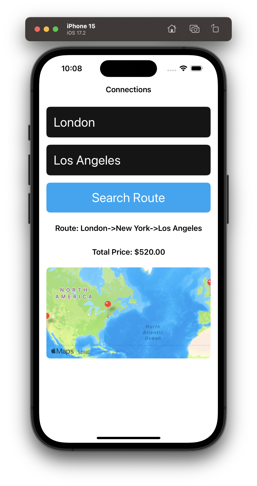
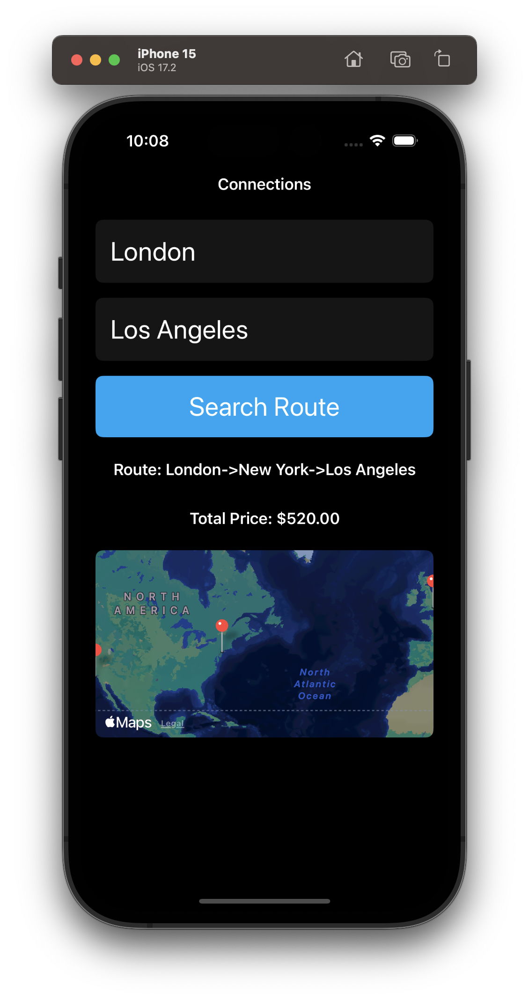

# TripPlanner
The purpose of this app is to find the cheapest route between the two cities that the user select and to show the total price in a label in the same page.

## Tools

The app is implemented using Swift programming langauge version 5.9.2. The UI part is done using SwiftUI. 
Deployment target is iOS 15.0. 

## Data Model
The network layer is implemented using combination of URLSession and Codable. The data binding is handled by Apple Combine Framework. 

## UI Architecture
The app is implemented using MVVM architecture. 
- `Model` is presented as `NetworkAgent` which is injected into ViewModel via protocol. For tests, `MockNetworkAgent` is injected for the realibility purposes. 
- `ViewModel`is responsible for routing calls from the View and transforming the data for presentation.

This layer consists of several objects: 
- `ConnectionsViewModel` - A View Model itself. 
- `RouteFinder` - Returns information about the route or error if the route hasn't been found.
- `MapViewHelper` - Returns data for the MapView
- A number of child view models - it allows to keep states separately and extend them if needed. For the test purposes, this models contain only few values but overall, it might contain much more configurations for the UI components, such as Font, Accessibility, Paddings etc. 

`View` consists of several SwiftUI views: textfiled, button, results view to mantain reusability is needed.

Navigation:
Navigation is not covered in this demo. 

## User Interface

| Light  | Dark |
| ------------- | ------------- |
|   |   |

## Test Coverage 

Unit tests:
The coverage below shows that succes pathes were mostly tested hovewer it still can be improved by moving UI configuration values to the view models and covering it with in unit tests or checking all `guard` statements and code execution branches. 

UI tests:
UI tests are not subject of this demo.
 

